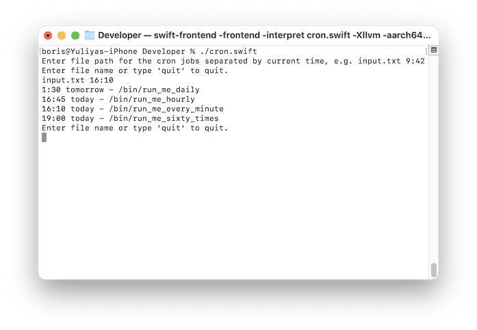

# cron-sim
A test project which parses a text file. Also an example of how to run Swift in the command line.

This is not a cron replacement. The program parses cron jobs and determines the next time a job will run.

- This is a Mac command line program and uses standard input and output
- The program continues to run until the user kills the process or types special command in the standard input
- Program reads a text file, parses it and initialises it into a model, then prints result

## Run in Terminal

Run `swift cron.swift` or `./cron.swift`.

## Run in Xcode

Open `cron-sim/cron-sim.xcodeproj`

