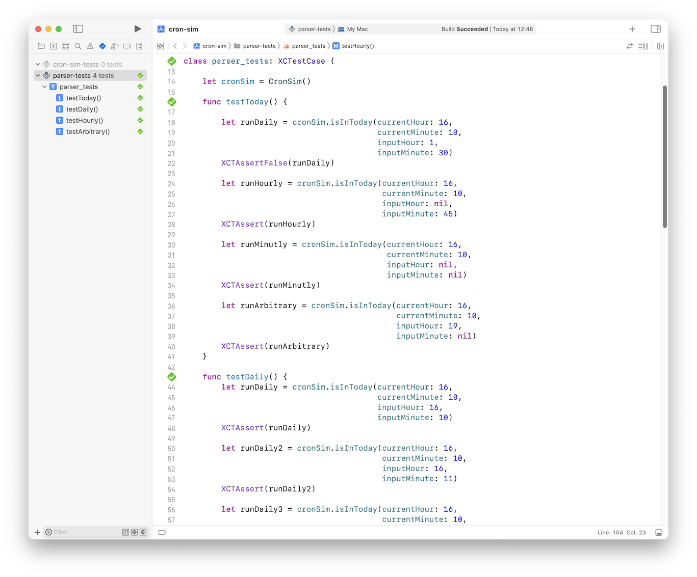

# cron-sim
A test project which emulates cron jobs, also an example how to run Swift in command line.

## Run in Terminal

Run `swift cron.swift` or `./cron.swift`.

## Run in Xcode

Open `cron-sim/cron-sim.xcodeproj`

